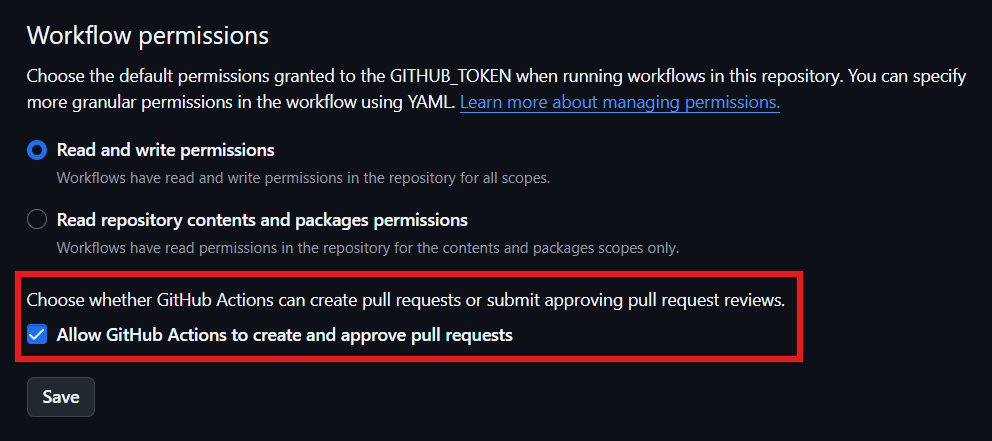

# Sitemap Creator
用 GitHub Action 🚀 在你的仓库中创建和更新网站地图。  

> [!TIP] 
> 这是 Sitemap Creator 的稳定版仓库。预发行版仓库请前往 [fjwxzde/Sitemap_Creator_Pre-Release](https://github.com/fjwxzde/Sitemap_Creator_Pre-Release) 查看。  

[](https://github.com/DuckDuckStudio/Sitemap_Creator/releases/latest)  
[反馈Bug🐛](https://github.com/DuckDuckStudio/Sitemap_Creator/issues) | [使用示例🚀](#4-使用示例)  

## 为什么选择 Sitemap Creator 🏆
| | Sitemap | Creator |  |
|-----|-----|----|----|
| 无需本地操作 | ✅ | 稳定更新 | ✅ |
| 完全免费 | ✅ | 修改时区 | ✅ |
| 指定更新/创建方式 | ✅ | 不遗漏页面 | ✅ |
| 忽略页面 | ✅ | 指定网站地图存放位置 | ✅ |
| 指定页面文件类型 | ✅ | 中文文档+输出 | ✅ |
| 更多 | 优点 | ... | ✅ |

## 可用参数
| 参数 | 描述 | 默认值 | 是否必须 | 备注 |
|-----|-----|-----|-----|-----|
| `location` | 网站地图的存放位置 (例如 `docs/sitemap.xml`) | `./sitemap.xml` (即仓库根目录) | 否 | / |
| `token` | 用于创建更新网站地图的拉取请求的 Token | `${{ github.token }}` | 否 | 您的 Token 至少应该具有 `repo` 权限来推送修改，如果使用默认的 Action Token 则需要在仓库设置中给 GitHub Action 写入权限<sup>[1](#1-如何允许-github-action-创建拉取请求--推送修改)</sup> |
| `timezone` | 设置生成时使用的时区 | `Asia/Shanghai` (上海，UTF+8，CST) | 否 | 遵循 IANA时区数据库（也称为Olson时区数据库）的格式 |
| `basic_link` | 指向你网站的基础链接 | `https://${{ github.event.repository.owner.login }}.github.io/${{ github.event.repository.name }}` | 否 | 结尾不要带 `/` |
| `file_type` | 网页文件的类型 (例如使用 docsify 部署的就是 md，可指定多个类型) | `html,md` | 否 | 不带`.`，`md`类型会自动去掉后缀名 |
| `ignore_file` | 指定哪些文件不包含在网站地图中 | `啥都没有` | 否 | `,`间隔 |
| `website_path` | 你的网站内容的位置 (例如 `./` (根目录) 或 `docs`) | `./` (根目录) | **是** | / |
| `base_branch` | 仓库主分支 (`main`，`master` 等) | `main` | 否 | / |
| `labels` | 创建拉取请求时添加的标签 | / | 否 | 会自动移除`'`、`"`、<code>\`</code>，可以设置`debug: true`来查看运行情况，标签间用`,`分隔 |
| `auto_merge` | 启用自动合并的方式 (不指定则不启用自动合并) | / | 否 | [可用的自动合并方式](#3-可用的自动合并方式)，[什么是自动合并](https://docs.github.com/zh/pull-requests/collaborating-with-pull-requests/incorporating-changes-from-a-pull-request/automatically-merging-a-pull-request) |
| `update` | 指定更新网站地图的方式 (直接提交或拉取请求) | `拉取请求` | 否 | [可用的参数值](#4-可用的修改网站地图的方式) |
| `debug` | 控制调试输出的开关 | `false` | 否 | 你用`true`还是`1`随便，js里真值<sup>[2](#2-java-script-中有哪些可用真值)</sup>的都行 |

## 帮助
### 1. 如何允许 GitHub Action 创建拉取请求 / 推送修改
打开仓库 Settings (上方栏) > Code and automation (左侧栏) > Actions (左侧栏子类别) > General (子类别) > Workflow permissions (划到最下面):  



### 2. Java Script 中有哪些可用真值
请见[真值 - MDN Web 文档术语表：Web 相关术语的定义 | MDN](https://developer.mozilla.org/zh-CN/docs/Glossary/Truthy)。  

### 3. 可用的自动合并方式
处理时会自动去除`'`、`"`、<code>\`</code>、`-`。  
| 接收的输入 (去除特殊字符后) | 自动合并方式 |
|-----|-----|
| `s`、`squash`、`压缩`、`压缩合并`、`压缩自动合并` | [压缩合并](https://docs.github.com/zh/pull-requests/collaborating-with-pull-requests/incorporating-changes-from-a-pull-request/about-pull-request-merges#squash-and-merge-your-commits) |
| `m`、`merge`、`合并`、`合并提交`、`提交` | [合并提交](https://docs.github.com/zh/pull-requests/collaborating-with-pull-requests/incorporating-changes-from-a-pull-request/about-pull-request-merges#merge-your-commits) |
| `r`、`rebase`、`变基`、`变基合并`、`变基自动合并` | [变基合并](https://docs.github.com/zh/pull-requests/collaborating-with-pull-requests/incorporating-changes-from-a-pull-request/about-pull-request-merges#rebase-and-merge-your-commits) |
| 空字符串 | 不启用自动合并 |
| 其他任意值 | 视作错误返回 `1` |

### 4. 可用的修改网站地图的方式
处理时会自动去除`'`、`"`、<code>\`</code>、`-`、` `。  
| 接收的输入 (去除特殊字符后) | 修改方式 |
|-----|-----|
| `pr`、`pullrequest`、`pullrequests`、`prs`、`拉取请求` | 创建拉取请求 (默认) |
| `commit`、`提交`、`直接提交`、`directcommit`、`commitdirectly` | 直接提交到主分支 |

### 5. 使用示例
```yml
name: 生成 Sitemap

# GitHub Actiion DuckDuckStudio/Sitemap_Creator 版本 1.0.2 示例工作流
# https://github.com/marketplace/actions/sitemap-creator-stable
# Under the [GNU Affero General Public License v3.0](https://github.com/DuckDuckStudio/Sitemap_Creator/blob/main/LICENSE)

on:
  push:
    branches:
      - main
      # 当 main 分支上有新推送且以下文件被更改时
    paths:
      - '**/*.html'
      - '**/*.md'
  workflow_dispatch: # 手动运行

jobs:
  generate_sitemap:
    runs-on: ubuntu-latest

    steps:
      - name: 更新网站地图
        uses: DuckDuckStudio/Sitemap_Creator@1.0.2
        with:
          location: "docs/sitemap.xml"
          basic_link: "https://duckduckstudio.github.io/Articles/#" # docsify 部署的
          ignore_file: "_Footer.md,404.html,某鸭的文章页面模板.html,营销号"
          website_path: "docs"
          labels: "DEV-已启用自动合并,工作流,DEV-开发分支合并"
          auto_merge: "压缩合并"
          debug: true # 启用调试输出
          # 其他参数默认
          # base_branch: "main"
          # file_type: "html,md"
          # token: ${{ github.token }}
          # timezone: "Asia/Shanghai"
          # update: "拉取请求"
```

## 星星🌟
如果您认为本项目对您有帮助，还请给本项目一个小小的 Star 。  
[](https://star-history.com/#DuckDuckStudio/Sitemap_Creator&Date)  
