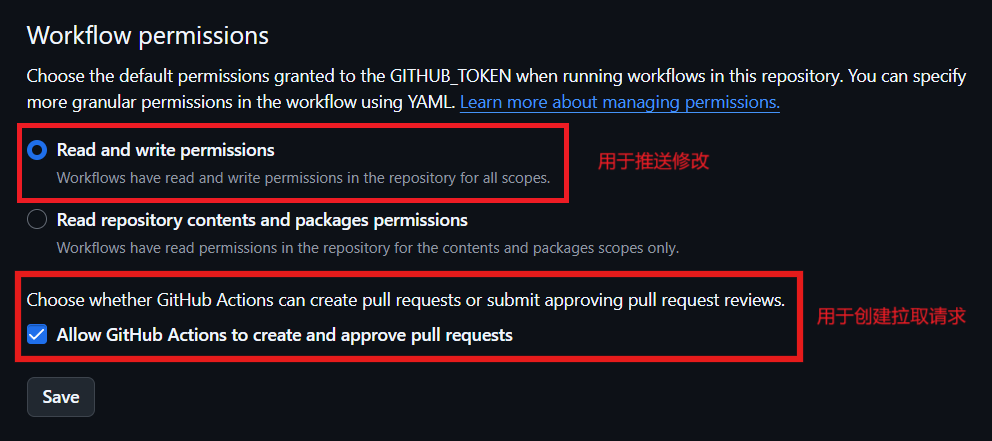

# Sitemap Creator
用 GitHub Action 🚀 在你的仓库中创建和更新网站地图。  

[反馈Bug🐛](https://github.com/DuckDuckStudio/Sitemap_Creator/issues) | [使用本Action🚀](https://github.com/marketplace/actions/sitemap-creator)

## 参数
| 参数 | 描述 | 默认值 | 是否必须 | 备注 |
|-----|-----|-----|-----|-----|
| `location` | 网站地图的存放位置 (例如 `docs/sitemap.xml`) | `./sitemap.xml` (即仓库根目录) | 否 | / |
| `token` | 用于创建更新网站地图的拉取请求的 Token | `${{ github.token }}` | 否 | 您的 Token 至少应该具有 `repo` 权限来创建拉取请求，如果使用默认的 Action Token 则需要在仓库设置中允许 GitHub Action 创建拉取请求[1](#如何允许-github-action-创建拉取请求) |
| `timezone` | 设置生成时使用的时区 | `Asia/Shanghai` (上海，UTF+8，CST) | 否 | 遵循 IANA时区数据库（也称为Olson时区数据库）的格式 |
| `basic_link` | 指向你网站的基础链接 | `https://${{ github.event.repository.owner.login }}.github.io/${{ github.event.repository.name }}` | 否 | 结尾不要带 `/` |
| `file_type` | 网页文件的类型 (例如使用 docsify 部署的就是 md，不指定则设为 html，可指定多个类型) | `html,md` | 否 | 不带`.`，`md`类型会自动去掉后缀名 |
| `ignore_file` | 指定哪些文件不包含在网站地图中 | `啥都没有` | 否 | `,`间隔 |
| `website_path` | 你的网站内容的位置 (例如 `./` (根目录) 或 `docs`) | `./` (根目录) | **是** | / |
| `base_branch` | 仓库主分支 (`main`，`master` 等) | `main` | 否 | / |
| `debug` | 控制调试输出的开关 | `false` | 否 | 你用`true`还是`1`随便，js里真值[2](#2-java-script-中有哪些可用真值)的都行 |

## 帮助
### 1. 如何允许 GitHub Action 创建拉取请求
打开仓库 Settings (上方栏) > Code and automation (左侧栏) > Actions (左侧栏子类别) > General (子类别) > Workflow permissions (划到最下面):  

### 2. Java Script 中有哪些可用真值
请见[真值 - MDN Web 文档术语表：Web 相关术语的定义 | MDN](https://developer.mozilla.org/zh-CN/docs/Glossary/Truthy)。  

## 星星🌟
如果您认为本项目对您有帮助，还请给本项目一个小小的 Star 。  
  
